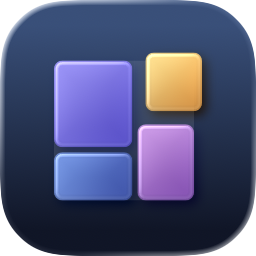
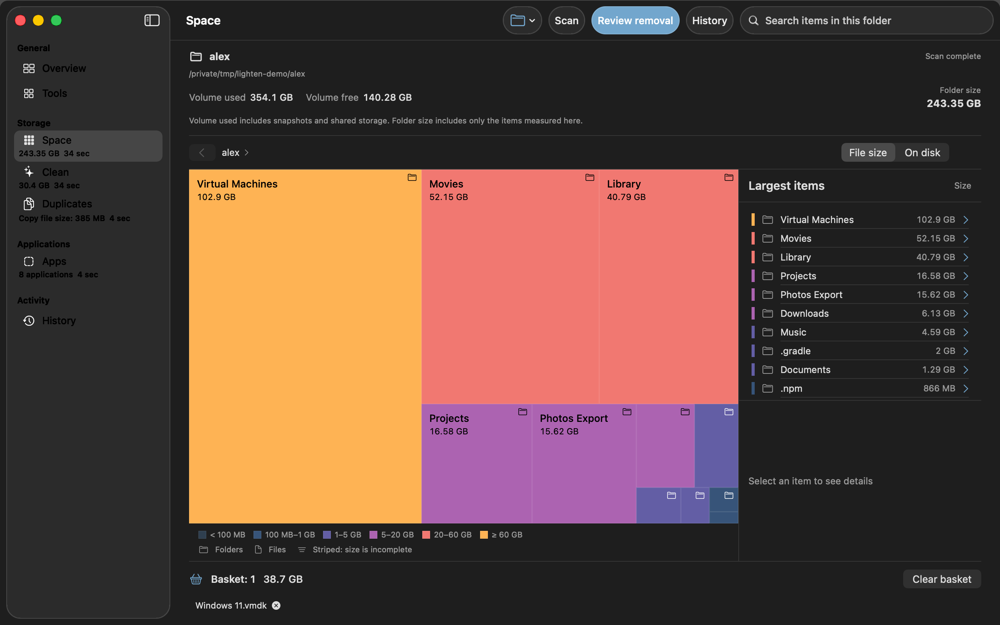
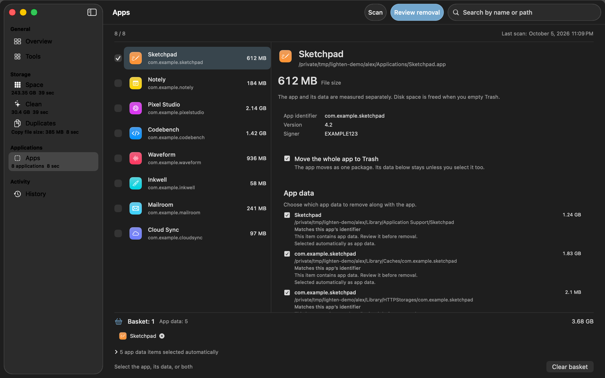
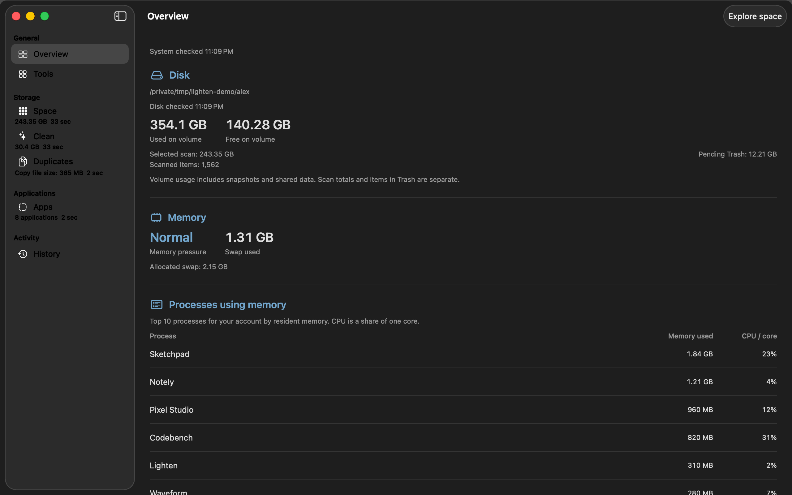
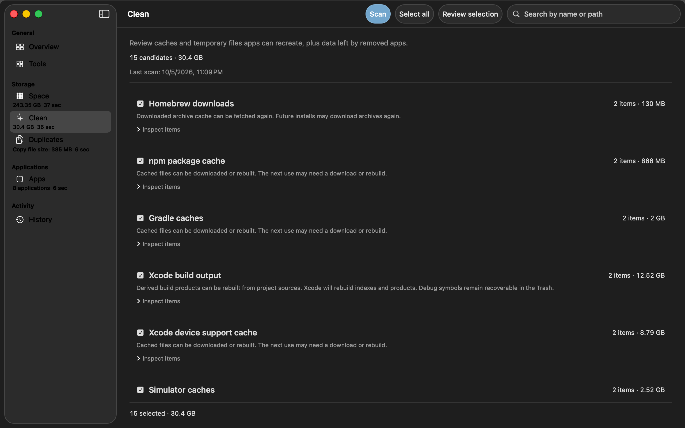
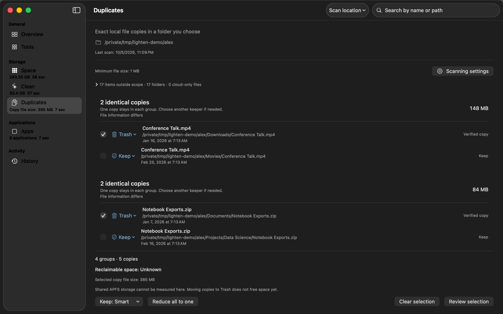
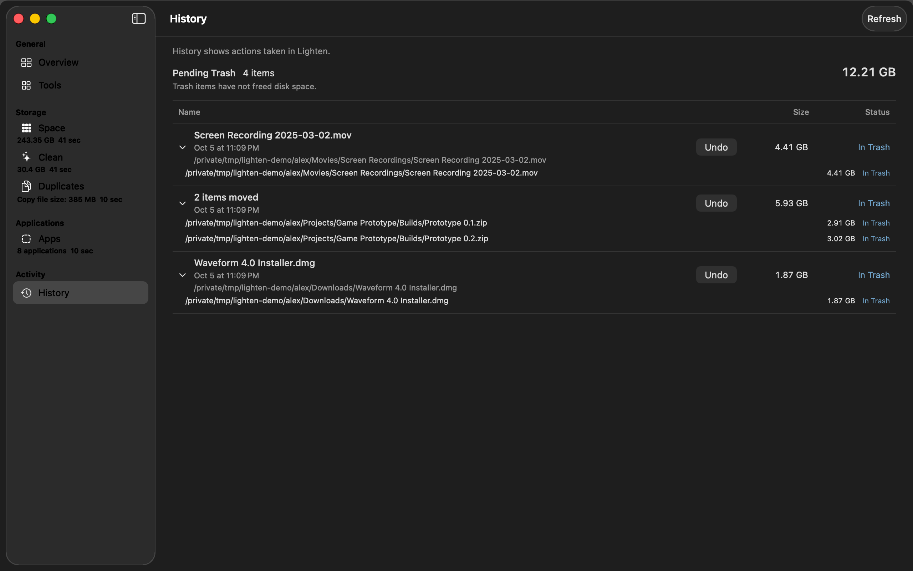

<p align="center">
  
</p>

<h1 align="center">Lighten</h1>

<p align="center">
  <strong>An honest, open-source cleaner for your Mac.</strong><br>
  See what takes up space, remove only what you choose, and undo anything.
</p>

<p align="center">
  <a href="https://github.com/tunatavsan/lighten/actions/workflows/ci.yml"></a>
  <a href="LICENSE"></a>
  
  
</p>

<p align="center">
  <picture>
    <source media="(prefers-color-scheme: light)" srcset="docs/images/space-light.png">
    
  </picture>
</p>

Most Mac cleaners promise gigabytes of "junk" and ask you to trust a single big button. Lighten takes the opposite
approach: it measures carefully, explains every suggestion, keeps your files recoverable, and never pretends to know
more than it does.

## Why Lighten

- **Real numbers.** Sizes come from the file system, not estimates. When macOS hides part of a folder, Lighten says
  "at least" instead of guessing.
- **Suggestions need evidence.** A cache is suggested only when its location is documented by the tool that owns it;
  app data is linked to an app through its bundle identifier, code signature or installer receipt. A similar name is
  never treated as proof.
- **Recoverable by default.** Items move to the Trash. Every action is written to a journal and can be undone from
  History. Permanent deletion is an opt-in setting and always asks for a separate confirmation.
- **Protected places stay protected.** Photos libraries, Mail, Messages, iCloud Drive, keychains, SSH keys and system
  files are never suggested. The complete list lives in [docs/SAFETY.md](docs/SAFETY.md), which is generated from the
  code and checked by the test suite.
- **Private.** Lighten makes no network connections, collects no analytics and needs no account. Everything stays on
  your Mac.

## Features

| | |
| --- | --- |
| **Overview** | Disk usage, memory pressure, swap and the processes using the most memory, at a glance. |
| **Space** | A fast, parallel scan of any folder or volume, shown as a treemap and a list of the largest items. Drill into folders, switch between logical and allocated sizes, and collect items in a basket before acting. |
| **Clean** | Reviews well-known caches of developer tools and apps: Xcode DerivedData, device support and simulators, Homebrew, npm, pnpm, Yarn, pip, uv, Cargo, Go, Gradle, and app caches and logs. Every entry cites the official documentation that describes the location. |
| **Duplicates** | Finds identical files by size, a content sample, a SHA-256 digest and a final byte-by-byte comparison. Choose which copy to keep: the smart pick, the newest, the oldest or the one in a preferred folder. |
| **Apps** | Uninstalls applications together with the preferences, caches, containers and other data that provably belong to them. If the app is running, Lighten can quit it gracefully first. |
| **History** | Lists every action Lighten has taken and restores items from the Trash with Undo. |

Lighten is available in English and Turkish.

<p align="center">
  <picture>
    <source media="(prefers-color-scheme: light)" srcset="docs/images/apps-light.png">
    
  </picture>
</p>

<details>
<summary><strong>More screenshots</strong></summary>
<br>
<p align="center">
  <br><br>
  <br><br>
  <br><br>
  
</p>
</details>

## Getting started

Lighten is an early preview. Signed and notarized downloads are not available yet, so for now you build it from
source.

**Requirements:** macOS 26 or later and Xcode 26 (Swift 6.2).

```sh
git clone https://github.com/tunatavsan/lighten.git
cd lighten
scripts/run.sh
```

`scripts/run.sh` builds a debug copy into `dist/Lighten.app` and opens it. To build a universal release build and
install it into `/Applications`, run `scripts/install.sh`.

The packaging script signs with your Developer ID Application or Apple Development identity when one is installed and
falls back to an ad hoc signature otherwise. Set `LIGHTEN_SIGN_IDENTITY` to choose a specific identity, or to `-` to
always sign ad hoc.

### Full Disk Access

Lighten works without special permissions. macOS keeps some folders, such as Mail, Safari and other apps' containers,
private until you grant Full Disk Access. Without it Lighten reports those folders as partially measured instead of
skipping them silently. You can grant access in **System Settings › Privacy & Security › Full Disk Access**. The
setting stays under your control; Lighten never changes it for you.

## Development

Lighten is a plain Swift package with no third-party dependencies and no Xcode project.

```sh
swift build                                   # build everything
swift test --no-parallel                      # run the test suites
swift format lint --strict -r Sources Tests   # check formatting (scripts/format.sh fixes it)
```

The suites run serially because several tests exercise real file system races, process activity and timing on the
machine they run on.

| Target | Purpose |
| --- | --- |
| `Lighten` | The SwiftUI app: windows, views and the stores behind them. |
| `LightenKit` | Scanning, cleanup planning, the action journal and Undo, independent of the UI. |
| `CLightenPlatform` | A small C layer over `getattrlistbulk` and process metadata. |
| `LightenBench` | `lighten-bench`, a command-line tool that measures the scan engines on synthetic trees. |

### How it works

- **Scanning.** A bounded pool of worker threads reads directories with `getattrlistbulk`, never follows symbolic links,
  stays on one volume and counts hard-linked files once. Totals stream to the UI while the scan runs, and every
  folder knows whether its size is complete or a lower bound.
- **Acting.** A confirmed selection becomes an immutable plan. The executor checks each item again right before it
  moves, writes the plan and every step to an on-disk journal, and records where each item landed in the Trash so it
  can be restored exactly.
- **Ownership.** App data is attributed by bundle identifiers, code-signing teams, installer receipts and native
  metadata. Anything that cannot be proven stays unselected and says why.

[ARCHITECTURE.md](ARCHITECTURE.md) describes the components and their contracts in detail.

## Roadmap

- [ ] Signed, notarized releases with automatic updates and a Homebrew cask
- [ ] New cleanup tools: large and old files, Downloads, Trash and project build artifacts
- [ ] Health tools: login and background items, memory and performance
- [ ] Similar image detection

Ideas and bug reports are welcome in [Issues](https://github.com/tunatavsan/lighten/issues).

## Contributing

Contributions are welcome. Please read [CONTRIBUTING.md](CONTRIBUTING.md) before opening a pull request, and report
security problems privately as described in [SECURITY.md](SECURITY.md).

## License

Lighten is released under the [MIT License](LICENSE).
